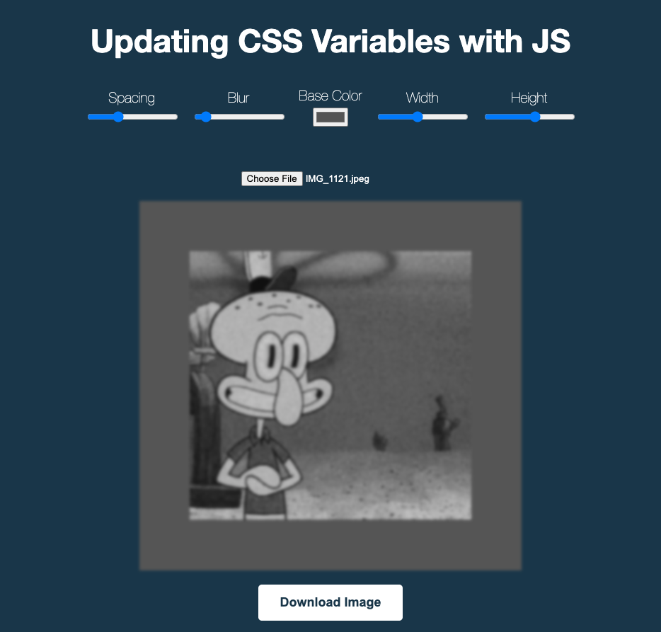

# CSS Variables Image Editor

An interactive web application that allows users to upload images and apply real-time visual effects using CSS custom properties (CSS Variables) controlled by intuitive sliders.




## Features

- **Image Upload & Preview** - Upload any image and see instant preview
- **Real-time Effects** - All changes apply immediately as you move sliders
- **5 Control Parameters:**
  - **Spacing** - Adjustable padding around the image (10-200px)
  - **Blur** - Variable blur effect (0-25px)
  - **Base Color** - Custom background color with color picker
  - **Width** - Image width control (100-800px)
  - **Height** - Image height control (100-600px)
- **Download Functionality** - Save your styled image as PNG to device
- **Responsive Design** - Grouped controls that wrap intelligently on smaller screens
- **Centered Layout** - Image always stays perfectly centered on screen

## Technologies Used

- **HTML5** - Semantic structure with file upload and canvas API
- **CSS3** - Custom properties (CSS Variables), flexbox, and responsive design
- **JavaScript (Vanilla)** - File handling, DOM manipulation, and canvas rendering

## How It Works

The application uses CSS custom properties that are dynamically updated via JavaScript:

```css
:root {
  --base: #ffc600;
  --spacing: 10px;
  --blur: 0px;
  --width: 500px;
  --height: 400px;
}

img {
  padding: var(--spacing);
  background: var(--base);
  filter: blur(var(--blur));
  width: var(--width);
  height: var(--height);
}
```

## Project Structure

- `index.html` - Complete application with HTML, CSS, and JavaScript
- All functionality is self-contained in a single file
- No external dependencies required

## Key Features Implemented

- ✅ File upload with instant preview
- ✅ Real-time CSS variable updates
- ✅ Canvas-based image download with all effects applied
- ✅ Responsive control layout with grouped label-input pairs
- ✅ Dynamic button styling that adapts to color selections
- ✅ Clean UI that hides elements until needed

## Future Improvements

- Add more filter effects (saturation, contrast, brightness)
- Implement preset style combinations
- Add image crop/rotate functionality
- Support for multiple image formats
- Batch processing for multiple images
- Save/load custom presets
