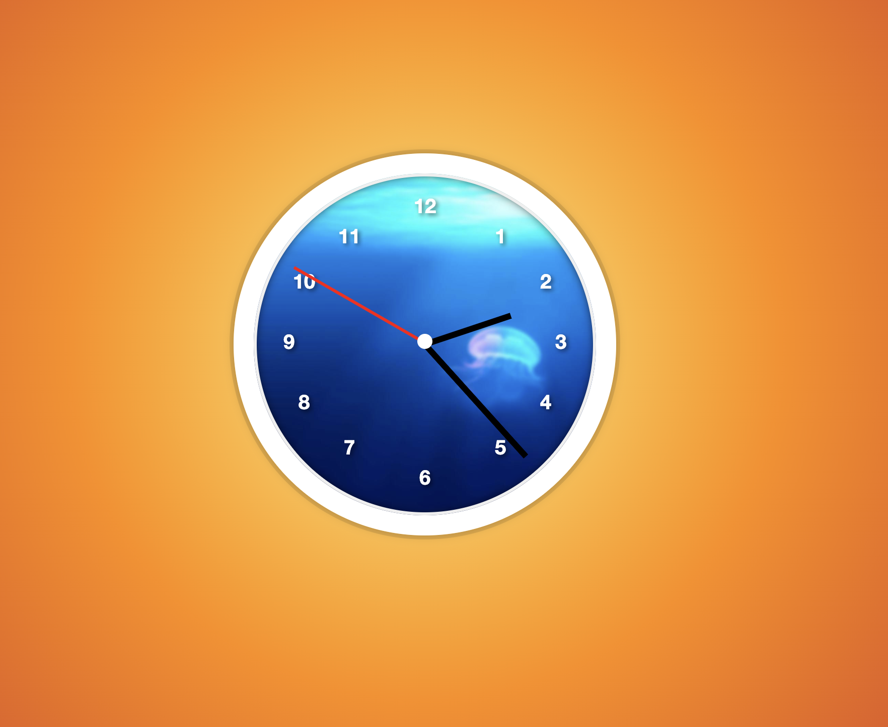

# JavaScript Analog Clock

A beautiful, real-time analog clock built with pure JavaScript, HTML, and CSS. Features smooth hand movements, proper time calculations, and a stunning gradient background.

## Features

- **Real-time accuracy** - Displays the current time with precise calculations
- **Smooth hand movement** - Hour hand moves gradually as minutes pass (just like a real clock)
- **Visual hierarchy** - Distinct hand lengths and colors for easy reading
  - Hour hand: Short and black
  - Minute hand: Medium length and black
  - Second hand: Thin and red
- **Clock face numbers** - Traditional 1-12 hour markers positioned around the perimeter
- **Responsive design** - Adapts to different screen sizes with media queries
- **Beautiful styling** - Gradient background with elegant shadows and animations

## Technologies Used

- **HTML5** - Semantic structure
- **CSS3** - Advanced styling with gradients, shadows, and responsive design
- **JavaScript (Vanilla)** - Real-time calculations and DOM manipulation

## How It Works

The clock uses JavaScript's `Date()` object to get the current time and calculates the rotation angles for each hand:

- **Second hand**: Updates every second (0-59 seconds → 0-360°)
- **Minute hand**: Updates every minute (0-59 minutes → 0-360°)
- **Hour hand**: Updates gradually with both hours AND minutes for realistic movement

## Project Structure

- `index.html` - Main HTML structure with clock elements
- `style.css` - Complete styling including responsive design
- Clock components are pure CSS and JavaScript (no external dependencies)

## Key Features Implemented

- ✅ Smooth second hand movement with transition prevention at 0 seconds
- ✅ Accurate hour hand that moves between hour markers
- ✅ Proper 24-hour to 12-hour time conversion
- ✅ Centered rotation for all hands
- ✅ Mobile-responsive design
- ✅ Hour numbers positioned around the clock face

## Future Improvements

- Add tick marks between hour numbers
- Implement different clock face themes
- Add digital time display option
- Create alarm functionality
- Add timezone selection
