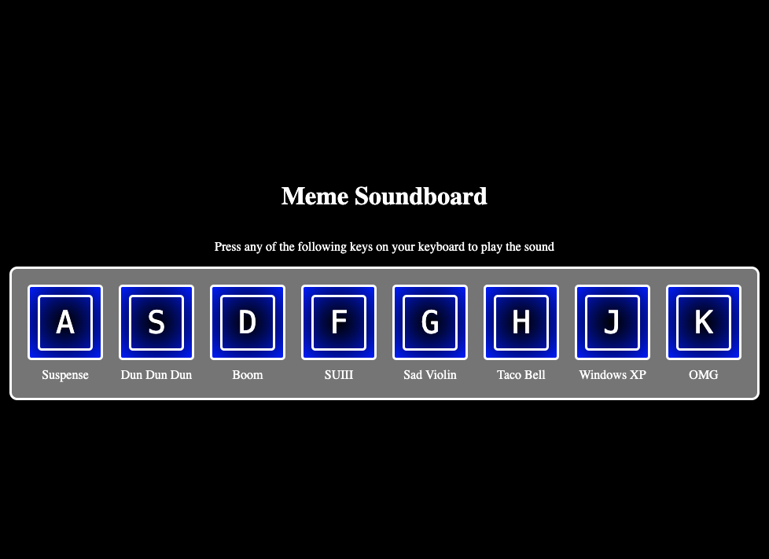

# Meme Soundboard

A fun interactive web application that plays meme sound effects when you press specific keys on your keyboard.

## Features

- Press keys A through K to play different meme sound effects
- Visual feedback with key animations when pressed
- Responsive design that works on all screen sizes
- Clean and modern UI with a dark theme

## Sound Effects Included

- A: Suspense sound effect
- S: Dramatic "Dun Dun Dun" sound
- D: Vine Boom sound
- F: "SUIII" sound
- G: Sad Violin
- H: Taco Bell sound
- J: Windows XP startup sound
- K: "OMG" sound effect

## Technologies Used

- HTML5
- CSS3
- JavaScript (Vanilla)

## How to Use

1. Clone this repository
2. Open `index.html` in your web browser
3. Press the corresponding keys (A-K) on your keyboard to play the sound effects

## Project Structure

- `index.html` - Main HTML file
- `style.css` - Styling and animations
- `script.js` - Sound playing logic and event listeners
- `sounds/` - Directory containing all sound effect files

## Future Improvements

- Add more sound effects
- Implement volume control
- Add mobile touch support
- Allow users to customize key bindings
